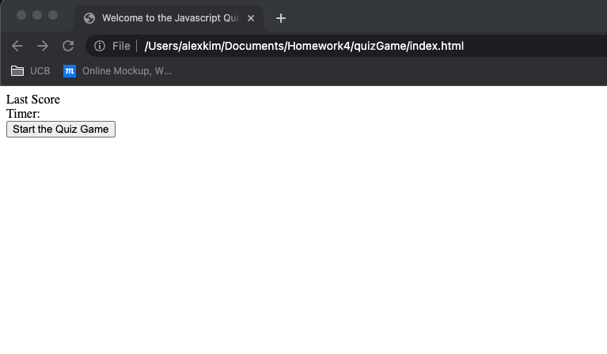
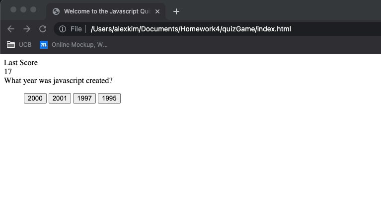
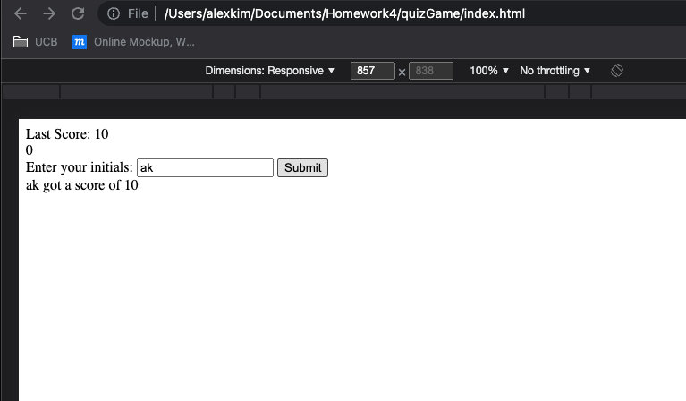

# quizGame
Javascript quiz game has 10 questions, you will get a +1 for each correct answer and your time will decrease by 5 seconds if you get one wrong. The timer starts at 45 seconds and the game ends when the timer hits 0 or you finish the quiz (whichever comes first). At the end of the game you can enter you initials and the quiz will write back your initial and your score.

I WANT to take a timed quiz on JavaScript fundamentals that stores high scores
SO THAT I can gauge my progress compared to my peers

GIVEN I am taking a code quiz

WHEN I click the start button
THEN a timer starts and I am presented with a question

WHEN I answer a question
THEN I am presented with another question

WHEN I answer a question incorrectly
THEN time is subtracted from the clock

WHEN all questions are answered or the timer reaches 0
THEN the game is over

WHEN the game is over
THEN I can save my initials and score
